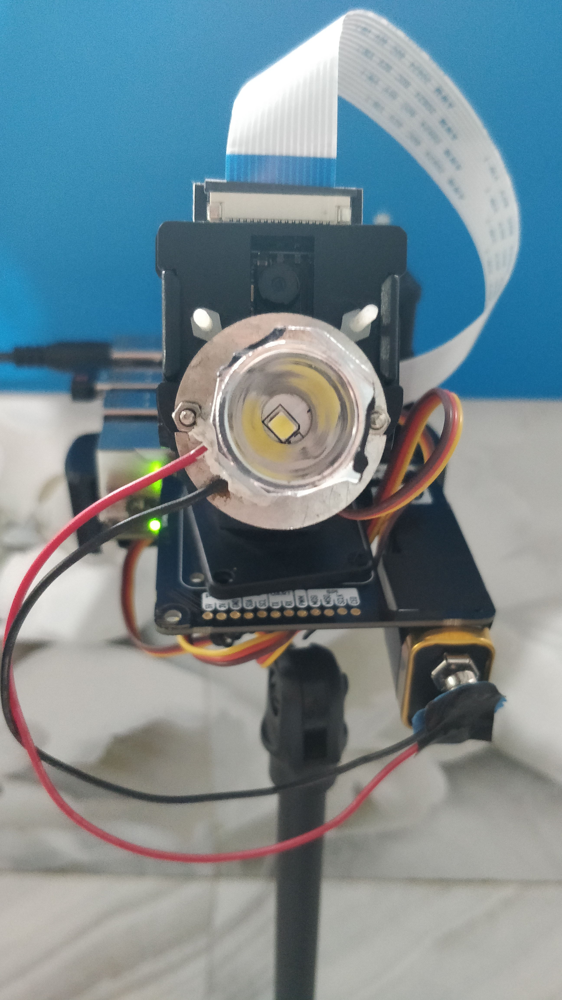
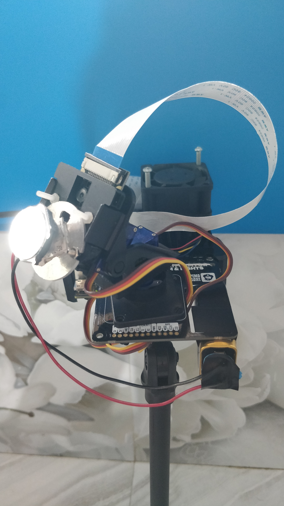

# Smart Workbench Lamp
This repo documents the steps and scripts required to run the tracking lamp program.

***

## Hardware requirements
- A single-board computer with 40 GPIO pins such as NVIDIA Jetson Nano or Raspberry Pi 4 Model B
- Pimoroni Pan-Tilt HAT ([link](https://shop.pimoroni.com/products/pan-tilt-hat?variant=22408353287))
- A compatible camera such as Raspberry Pi 2 or IMX 219 ([link](https://www.waveshare.com/IMX219-77-Camera.htm))
- Cooling fan (for Jetson Nano)

> **I am using a Jetson Nano (4GB) with a IMX 219 camera and Pimoroni Pan-Tilt HAT full kit.** Cooling fan is a must.

## Software requirements

1. opencv >= 4.5.0
2. smbus
3. imutils
4. pantilthat

Build OpenCV from source on Jetson Nano: https://qengineering.eu/install-opencv-4.5-on-jetson-nano.html

Build OpenCV from source on Raspberry Pi 4: https://qengineering.eu/install-opencv-4.5-on-raspberry-pi-4.html

    sudo apt-get install python3-smbus
    pip install imutils
    pip install pantilthat
    
Note: If you are working in a virtual environment, you need to create a sym-link `smbus` into your virtual environment:

    cd <virtual env>/lib/python3.6/site-packages/
    ln -s /usr/lib/python3/dist-packages/smbus.cpython-35m-arm-linux-gnueabihf.so smbus.so

# File Desciptions

`camera.py` : Helper program to confirm that the camera is working properly on the device. 3 modes available:  
0 : Laptop/Desktop (default)  
1 : Raspberry Pi  
2 : Jetson Nano

    python camera.py --mode 0

Note: Press 'q' to exit.

`1_detection.py` : Detect hands in a live video stream by utilizing readNetFromTensorflow() function from OpenCV. A confidence threshold of 0.8 is set to filter out weak detection. Boxes and Confidence scores are drawn. The above 3 modes are available.

    python 1_detection.py -m 2

`2_tracking.py` : Combination of DL detector and OpenCV tracker to achieve higher FPS. 3 OpenCV trackers available (read more [here](https://www.pyimagesearch.com/2018/07/30/opencv-object-tracking/)):  
csrt : Slower but more accurate  
kcf : Faster but less accurate  
`mosse` : Extremely fast and not as accurate as CSRT or KCF (**default**)  

Threshold confidence can be passed as a float value < 1. Default is `0.8`.

Skip frames refers to the number of frames that should be skipped before running the detector. For example, if the video throughput is 15 FPS, it means 15 frames are being processed every second. Setting skip-frames=15 means that the detector will be run after every 15 frames or 1 second. (read more [here](https://www.pyimagesearch.com/2018/08/13/opencv-people-counter/)). Default is `15`.

Width of the processed frame can be passed as an int. The aspect ratio is preserved. Smaller dimensions mean lesser pixels to process and therefore an increase in performance. Default is `500`.

    python 2_tracking.py -m 2 --tracker mosse --confidence 0.8 --skip-frames 15 --width 500

*Note: Experiment and adjust these 4 parameters: tracker type, confidence, skip frames and frame width to achieve a good balance between speed and accuracy. The above defaults work on my Jetson Nano.*

`pantilt.py` : Helper program to test the pantilthat library and visualize the range of the motors through 180° in 2 directions. A Pan Tilt HAT is connected to the 40 GPIO pins and controls the 2 servo motors. Since a Pan Tilt HAT cannot be connected to a laptop/desktop, this program can run only on Raspberry Pi or a Jetson Nano. The camera is attached on the top of the HAT.

    python pantilt.py

Note: Press 'Ctrl+C' in the terminal to exit.

`pid.py` : Helper function to smooth out the control signal sent to the pan and tilt motors using a simple Proportional-Integral-Derivative controller.

`3_fullsystem.py` : This program detects hands and drives the pan-tilt motors to keep the target object in the middle of the frame. It only works on Raspberry Pi (mode=0) or a Jetson Nano (mode=1). Another important step is tuning the pan and tilt PIDs independently. Please refer to the source [here](https://www.pyimagesearch.com/2019/04/01/pan-tilt-face-tracking-with-a-raspberry-pi-and-opencv/). I have infused my hand tracking algorithm into the pan tilt program by Adrian Rosebrock of [PyImageSearch](https://www.pyimagesearch.com/). The 4 parameters descibed in the previous program are available in this program too and can be adjusted similarly.

    python 3_fullsystem.py -m 1 (for Jetson Nano)
    
Note: Press 'Ctrl+C' in the terminal to exit.

## Light Source

**Time to get creative!** A light source needs to be installed close to the camera so that the light can illuminate the area where the pan-tilt mechanism is focusing the camera. I bought a small spotlight and screwed it open. After removing the AC-DC converter, I stuck a 9V battery underneath the Jetson Nano. The inside of the spotlight consisted of a LED and glass focus. I screwed it just below the camera and made sure that it is not obstructing the camera field of view.

***

***

## Acknowledgements

Bambach, S., Lee, S., Crandall, D. J., and Yu, C. 2015. “Lending A Hand: Detecting Hands and Recognizing Activities in Complex Egocentric Interactions,” in ICCV, pp. 1949–1957 (available at https://www.cv-foundation.org/openaccess/content_iccv_2015/html/Bambach_Lending_A_Hand_ICCV_2015_paper.html).

Victor Dibia, HandTrack: A Library For Prototyping Real-time Hand TrackingInterfaces using Convolutional Neural Networks, https://github.com/victordibia/handtracking

Adrian Rosebrock, OpenCV People Counter, PyImageSearch, https://www.pyimagesearch.com/2018/08/13/opencv-people-counter/

Adrian Rosebrock, Pan/tilt face tracking with a Raspberry Pi and OpenCV, PyImageSearch, https://www.pyimagesearch.com/2019/04/01/pan-tilt-face-tracking-with-a-raspberry-pi-and-opencv/
